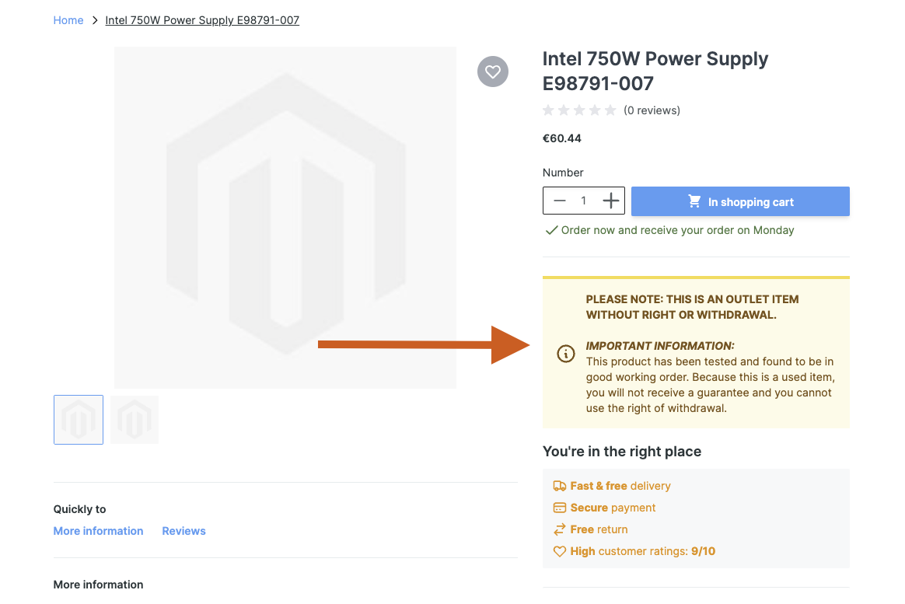
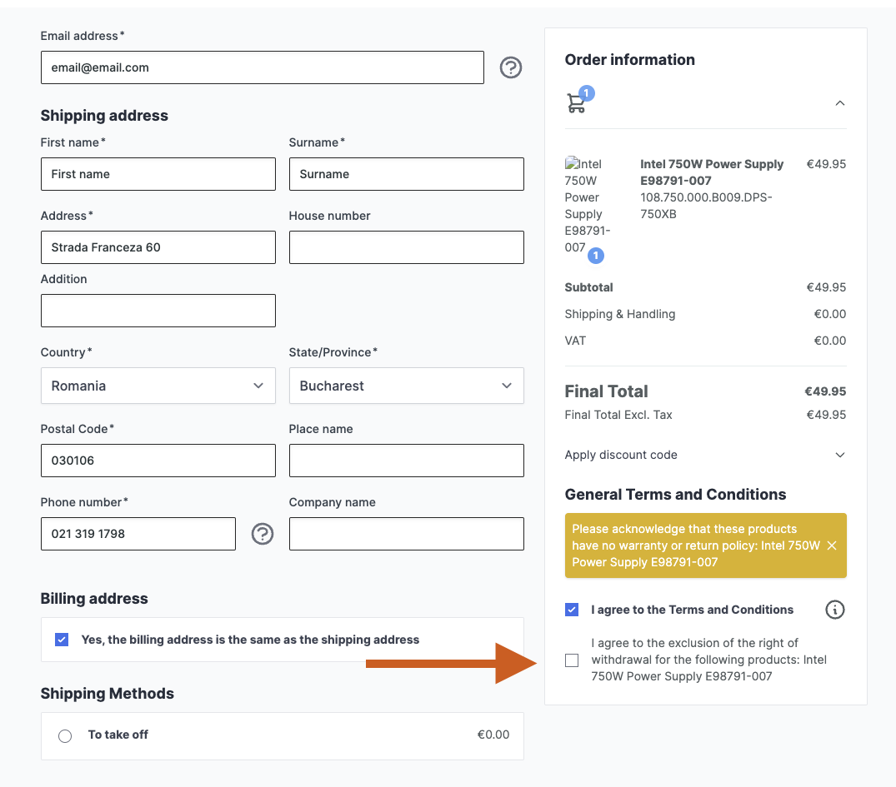
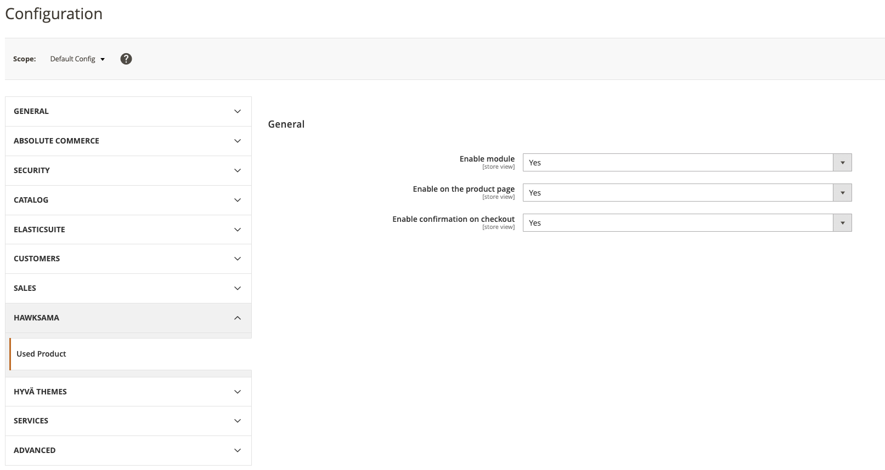
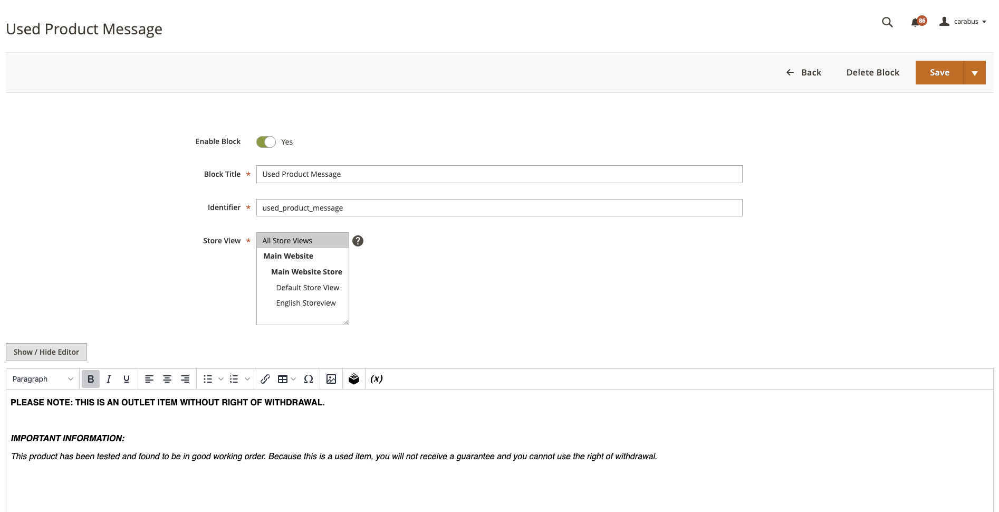

# Hawksama_HyvaCheckoutUsedProductNotice

**Hawksama_HyvaCheckoutUsedProductNotice** is a Magento 2 module that **extends** [Hawksama_HyvaUsedProductNotice](https://github.com/hawksama/hyva-used-product-notice) to add a **checkout confirmation step** for used or “no-warranty” products on **Hyvä Checkout**.

> **Important**
> - If you only need the **product page** disclaimer, install **Hawksama_HyvaUsedProductNotice** without this module.
> - If you want **both** product page notices **and** a checkout confirmation step, install **this** module:
>   ```bash
>   composer require hawksama/hyva-checkout-used-product-notice
>   ```
> - You **must** have **Hyvä Checkout** installed for this module to function correctly. Otherwise, you will encounter errors.

---

## Overview

1. **Extends the Used Product Notice**
    - By default, Hawksama_HyvaUsedProductNotice shows a notice on the product detail page for items flagged as “used.”
    - This module adds **checkout-level** functionality that **requires** customers to confirm they understand these items have no warranty or return policy before placing an order.

2. **Hyvä-Exclusive**
    - Built specifically for **Hyvä Checkout** using Magewire. If you don’t use Hyvä Checkout, this module is not applicable.

3. **Customer Consent**
    - During checkout, customers see a checkbox acknowledging the limited return/warranty policy for used goods.
    - No consent → they can’t finalize the checkout. This ensures clarity and reduces potential disputes.

---

## Product Page Example

When a product is marked as “used,” a notice appears below the price or any custom block you configure:



---

## Checkout Page Example

When a product is flagged as “used,” this module injects a confirmation step into the **Hyvä Checkout** flow. A checkbox appears prompting the customer to acknowledge that these items come with limited or no warranty/return policy. This ensures the customer is fully informed before they place their order:



1. **Clear Messaging**  
   A concise label or disclaimer text (customizable via CMS block or configuration) appears next to the checkbox, explaining the policy for used products.

2. **Required Confirmation**  
   If the customer doesn’t check the box, they can’t proceed with the checkout. This prevents accidental purchases or misunderstandings about return rights.

3. **Seamless Integration**  
   The checkbox and disclaimer are rendered via a Magewire component, blending neatly into the Hyvä Checkout UI without disrupting the customer experience.

---

## Admin Configuration

Enable or customize the “used product” notices directly in Magento’s **Stores > Configuration**.  
Below is a screenshot of the admin settings:



---

## Features

- **Seamless Hyvä Checkout Integration**: Adds a Magewire component that hooks into the Hyvä checkout flow.
- **Session-Based Consent**: Customer acknowledgment persists during the checkout session.
- **Customizable Language**: Adjust disclaimers to suit your store’s branding and legal requirements.
- **Lightweight Extension**: Focuses on the checkout experience; all product page logic remains in the original module.

---

## CMS Block Usage

You can edit the CMS block with id `used_product_message` and make it tailored to your store needs:



---

## Requirements

- **Magento 2.4.x**
- **Hyvä Themes** with **Hyvä Checkout** enabled
- [Hawksama_HyvaUsedProductNotice](https://github.com/hawksama/hyva-used-product-notice) (for the underlying “used product” attribute checks)

---

## Configuration

- **Checkout Consent**: In your admin panel, ensure the “Enable On Checkout” option is on.
- **Hyvä Checkout**: Confirm you’re running Hyvä Checkout so the Magewire component can properly render.

---

## Usage & Customization

- Once this module is enabled, any items with the `used_product` attribute set to `true` will trigger a **consent checkbox** on the checkout page.

---

## Known Limitations

1. **Hyvä Dependency**
    - This module will not function with Luma or other checkouts.
2. **Single-Attribute Check**
    - Currently monitors a single attribute (e.g., `used_product`); extending to multiple attributes might require custom logic.

---

## License & Contributing

- **License**: Distributed under the [MIT License](LICENSE).
- **Contributions**: Feedback and PRs are welcome. Feel free to open an issue or submit improvements.

---

## Installation

```bash
composer require hawksama/hyva-checkout-used-product-notice
bin/magento setup:upgrade
bin/magento cache:flush
```

---

## Contact

For any questions or suggestions:
- **Maintainer**: [Alexandru Carabus](https://www.linkedin.com/in/alexandru-manuel-carabus/)
- **Email**: [manue971@icloud.com](mailto:manue971@icloud.com)
- Or open an issue in this repository.

**Thank you for using Hawksama_HyvaCheckoutUsed


